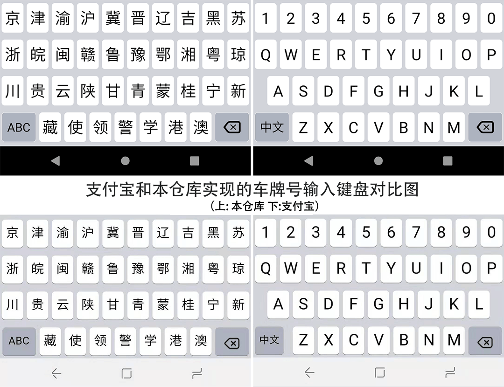
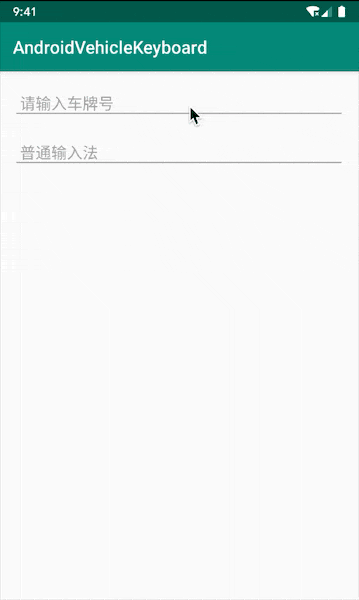

# VehicleEditText

[  ](https://bintray.com/relish-wang/maven/vehicleedittext/1.0.1/link)

Android用于车牌号输入的自定义键盘.仿"支付宝-车主服务-添加车辆-车牌号"输入框展示的车牌号输入键盘。

以下是本作与支付宝的对比图:


## 一、效果展示



## 二、如何使用

在`app/build.gradle`的`dependencies`节点下添加:
```groovy
implementation "wang.relish.widget:vehicleedittext:1.0.2"
```

### 1 使用原生EditText(**推荐**)
如果你不需要为EditText设置以下的监听器:
- View.OnTouchListener
- View.OnFocusChangeListener
- View.OnKeyListener
你可以使用下面这种侵入性小的方式。

```java
EditText vehicleEditText = findViewById(R.id.vet);
VehicleKeyboardHelper.bind(vehicleEditText); // 为输入框绑定车牌号输入键盘
```

### 2 使用wang.relish.widget.VehicleEditText(不推荐)

和正常的EditText一样使用即可。

不过需要注意如果你需要设置以下监听器:
- View.OnTouchListener
- View.OnFocusChangeListener
- View.OnKeyListener

请使用VehicleEditText的
- setOnTouchListener2
- setOnFocusChangeListener2
- setOnKeyListener2

因为这些监听器已经在VehicleKeyboardHelper中被使用了, 重复设置会覆盖原有的功能。

```xml
<wang.relish.widget.VehicleEditText
    android:id="@+id/vet"
    android:layout_width="match_parent"
    android:layout_height="wrap_content" />
```

## 三、注意事项

要求创建的EditText所持有的Context是Activity, 否则无法正常弹出车牌号输入法。// 暂时未修复这个问题(欢迎Merge Request)

## 四、混淆配置

无

## 五、升级日志

[CHANGELOG.md](./CHANGELOG.md)

## 六、致谢

感谢[pxxhbc](https://github.com/pxxhbc)提出此项目的缺陷。